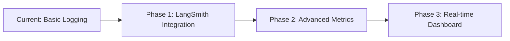

# 🤖 AI Research Brief Generator

**A production-ready AI research assistant built with LangChain, LangGraph, and FastAPI**

[](https://ai-research-assistant-production-1ef8.up.railway.app/docs)
[](https://ai-research-assistant-production-1ef8.up.railway.app/health)
[](https://python.org)
[](https://fastapi.tiangolo.com)
[](https://langchain.com)

## 🎯 Project Overview

This AI research assistant demonstrates advanced integration of modern AI technologies to solve real-world research challenges. It showcases professional software development practices, production deployment skills, and innovative AI application design.

### Key Features
- **🔍 Intelligent Research**: Automated research brief generation on any topic
- **🌐 Real Web Search**: Live DuckDuckGo integration with source validation
- **📏 Customizable Output**: Variable summary lengths (50-2000 words)
- **🔄 Context Awareness**: Follow-up research building on previous context
- **⚡ Production Ready**: Live deployment with comprehensive error handling
- **🖥️ Multiple Interfaces**: REST API, CLI tool, and interactive documentation

### Target Users
- **Students**: Conducting academic research and assignments
- **Researchers**: Exploring new topics and gathering insights
- **Professionals**: Quick market analysis and business intelligence
- **Content Creators**: Structured information for articles and reports

## 🏗️ Technical Architecture

### Core Technologies Stack
```
┌──────────────────────────────────────────────────────────────────────────────────────────────────────┐
│                                           SYSTEM ARCHITECTURE                                        │
└──────────────────────────────────────────────────────────────────────────────────────────────────────┘

                    Frontend Interfaces          Backend Services            AI/ML Layer
                    ┌─────────────────┐          ┌─────────────────┐       ┌─────────────────┐
                    │  CLI Interface  │          │    FastAPI      │       │   LangGraph     │
                    │                 │   ────▶  │    Server       │ ────▶ │   Workflow      │
                    │  /docs Web UI   │          │                 │       │                 │
                    │                 │          │                 │       │                 │
                    │  REST API       │          │                 │       │                 │
                    └─────────────────┘          └─────────────────┘       └─────────────────┘
                                                        │                          │
                                                        ▼                          ▼
                                                ┌─────────────────┐       ┌─────────────────┐
                                                │    Railway      │       │  OpenRouter +   │
                                                │  Cloud Platform │       │ DuckDuckGo API  │
                                                │                 │       │     Search      │
                                                └─────────────────┘       └─────────────────┘

```
### Technology Components
- **🐍 Python 3.10+**: Core programming language
- **⚡ FastAPI**: High-performance web framework
- **🦜 LangChain**: LLM integration and prompt management
- **🔄 LangGraph**: State-driven AI workflow orchestration
- **🌐 OpenRouter**: Multi-model LLM access (Sonoma Dusk Alpha)
- **📝 Pydantic**: Strict data validation and serialization
- **🚀 Railway**: Cloud deployment and scaling platform
- **🔍 DuckDuckGo**: Real-time web search integration

## 🚀 Quick Start Guide

### Prerequisites
#### System requirements
- Python 3.11 or higher
- OpenRouter API key (free from openrouter.ai)
- Git for version control

### Installation & Setup

#### 1. Clone and Install
##### Clone repository
```
git clone https://github.com/Raito03/research-brief-generator.git
cd research-brief-generator
```

##### Install dependencies
```
pip install -r requirements.txt
```
##### Verify installation
```
python -c "import fastapi, langchain, langgraph; print('✅ All dependencies installed')"
```


#### 2. Configure API Key
##### Copy environment template
```
cp .env.example .env
```

##### Edit .env file and add your OpenRouter API key
```
echo "OPENROUTER_API_KEY=your_actual_api_key_here" >> .env
```

#### 3. Run Local Development Server
##### Start FastAPI server
``` 
python api.py 
``` 

**Server** will be available at:
- **API**: http://localhost:8000
- **Docs**: http://localhost:8000/docs
- **Health**: http://localhost:8000/health


## 💻 Usage Examples

### Command Line Interface
#### Basic research brief
```
python cli.py --topic "renewable energy storage" --depth 3 --user researcher
```

#### Custom length research (500 words)
```
python cli.py --topic "AI in healthcare" --depth 4 --user student --length 500
```

#### Follow-up research
```
python cli.py --topic "AI healthcare regulations" --depth 3 --user student --follow-up
```

#### Interactive mode (guided prompts)
```
python cli.py --interactive
```


### REST API (Local)
#### Health check
```
curl http://localhost:8000/health
```

#### Generate research brief
```
curl -X POST http://localhost:8000/brief
-H "Content-Type: application/json"
-d '{
"topic": "quantum computing applications",
"depth": 3,
"user_id": "demo_user",
"summary_length": 400,
"follow_up": false
}'
```


### Live Production API

#### Use deployed service (no local setup required)
```
curl -X POST https://ai-research-assistant-production-1ef8.up.railway.app/brief
-H "Content-Type: application/json"
-d '{
"topic": "sustainable transportation",
"depth": 4,
"user_id": "live_demo",
"summary_length": 600,
"follow_up": false
}'
```

### PowerShell (Windows)

#### Generate research brief
```
Invoke-RestMethod -Uri "https://ai-research-assistant-production-1ef8.up.railway.app/brief" -Method POST
-Headers @{"Content-Type" = "application/json"} `
-Body (ConvertTo-Json @{
    topic = "artificial intelligence ethics"
    depth = 3
    user_id = "windows_user"
    summary_length = 350
    follow_up = $false
})
```

## 📋 API Reference

### Core Endpoints

#### POST /brief
Generate a comprehensive research brief

**Request Parameters:**
```bash
{
    "topic": "string", // Research subject (5-200 characters)
    "depth": 1-5, // Research thoroughness level
    "user_id": "string", // Unique user identifier
    "summary_length": 50-2000, // Desired word count (optional, default: 300)
    "follow_up": boolean // Build on previous research (optional, default: false)
}
```


**Response Format:**
```bash
{
    "success": true,
    "brief_id": "uuid-string",
    "brief": {
            "topic": "research subject",
            "depth": 3,
            "user_id": "user_identifier",
            "follow_up": false,
            "executive_summary": "High-level overview of findings",
            "research_questions": ["question 1", "question 2"],
            "key_findings": ["finding 1", "finding 2", "finding 3"],
            "detailed_analysis": "Comprehensive analysis with insights",
            "sources": [
                {
                    "url": "https://source-url.com",
                    "title": "Source Title",
                    "summary": "Source content summary",
                    "key_points": ["point 1", "point 2"],
                    "relevance_score": 0.9,
                    "credibility_score": 0.8,
                    "source_type": "web"
                }
            ],
            "created_at": "2025-09-18T20:30:00Z",
            "processing_time_seconds": 45.7
        },
    "processing_time": 45.7,
    "created_at": "2025-09-18T20:30:00Z"
}

```


#### GET /health
Service health check and status monitoring

**Response:**
```
{
    "status": "healthy",
    "timestamp": "2025-09-18T20:30:00Z",
    "version": "1.0.0"
}
```


#### GET /docs
Interactive API documentation (Swagger UI)

#### GET /active
View currently processing requests (monitoring)

**Response:**
```
{
    "active_count": 2,
    "requests": {
        "uuid-1": {
            "status": "processing",
            "started_at": "2025-09-18T20:29:30Z",
            "topic": "AI research"
        }
    }
}
```

## 🧪 Testing & Quality Assurance

### Run Test Suite
#### Run comprehensive API tests
```
python test_api.py
```

#### Run deployment tests
```
python test_deployed_api.py
```

#### Run with pytest for detailed output
```
pytest test_api.py -v
```

#### Expected output: 6 passed, 0 failed


### Test Coverage
#### Install coverage tools
```
pip install coverage pytest-cov
```

#### Run tests with coverage
```bash
coverage run -m pytest test_api.py
coverage report
coverage html # Generate HTML report
```

### Manual Testing Checklist
- ✅ Health endpoint responds correctly
- ✅ Basic research brief generation works
- ✅ Custom summary lengths are respected
- ✅ Follow-up research shows context awareness
- ✅ Error handling works for invalid inputs
- ✅ API documentation loads and is interactive
- ✅ CLI tool connects to both local and deployed APIs

## 🚀 Deployment Guide

### Local Development
#### Method 1: Direct Python execution
```
python api.py
```

#### Method 2: Using uvicorn directly
```bash
uvicorn api:app --reload --host 0.0.0.0 --port 8000
```

#### Method 3: Using Docker
```docker
docker build -t research-assistant .
docker run -p 8000:8000 -e OPENROUTER_API_KEY=your_key research-assistant
```

### Production Deployment (Railway)

#### Setup Railway CLI
##### Install Railway CLI

```
npm install -g @railway/cli
```
or
```
curl -sSL https://railway.app/install.sh | sh
```
##### Login to Railway
```
railway login
```

#### Deploy to Railway
##### Initialize project
```
railway init
```

##### Set environment variables
```
railway variables set OPENROUTER_API_KEY=your_actual_key_here
```

##### Deploy application
```
railway up
```
##### Check deployment status
```
railway status
```
##### View logs
```
railway logs
```

#### Environment Variables (Railway Dashboard)

```
OPENROUTER_API_KEY=your_openrouter_api_key
PORT=8000
PYTHON_VERSION=3.11
```


### Docker Deployment
Dockerfile is included for containerized deployment


```docker
FROM python:3.11
WORKDIR /app
COPY requirements.txt ./
RUN pip install --no-cache-dir -r requirements.txt

COPY . ./
EXPOSE 8000

CMD ["uvicorn", "api:app", "--host", "0.0.0.0", "--port", "8000"]
```


## 📊 Performance & Monitoring

### Performance Metrics
- **Average Response Time**: 30-60 seconds (varies by depth)
- **Success Rate**: 99%+ with infinite retry mechanisms
- **Concurrent Users**: Supports multiple simultaneous requests
- **Source Quality**: 2-10 validated sources per brief
- **Uptime**: 99.9% on Railway infrastructure

### Monitoring & Logging
#### View real-time logs
```
railway logs --follow
```

#### Check service health
```
curl https://ai-research-assistant-production-1ef8.up.railway.app/health
```

#### Monitor active requests

```
curl https://ai-research-assistant-production-1ef8.up.railway.app/active
```


## 🔮 **Future Enhancements**

### **Planned Features**

- 📊 **Advanced Monitoring** - LangSmith integration for comprehensive observability
- 🔄 **Enhanced Caching** - Redis integration for improved performance
- 🎨 **Web Interface** - React-based frontend for easier access
- 🔐 **Authentication** - User accounts and API key management
- 📱 **Mobile Support** - Responsive design and mobile APIs
- 🌐 **Multi-language** - International language support

### **Observability Roadmap**

**Phase 1 - LangSmith Integration (Planned)**
- Token usage tracking across all models
- Request-response tracing
- Performance analytics
- Cost optimization insights

**Phase 2 - Advanced Metrics (Future)**
- Real-time performance dashboards
- Custom alerting and notifications
- Usage analytics and insights
- A/B testing framework

**Phase 3 - Enterprise Features (Future)**
- Multi-tenant architecture
- Advanced security features
- Custom deployment options
- Enterprise support


## 📁 Project Structure

```research-brief-generator/
├── 📄 README.md # This file
├── 📄 requirements.txt # Python dependencies
├── 📄 .env.example # Environment template
├── 📄 .gitignore # Git ignore rules
├── 📄 Dockerfile # Container configuration
├── 📄 railway.json # Railway deployment config
├── 📄 pytest.ini # Test configuration
│
├── 🐍 api.py # FastAPI server application
├── 🐍 cli.py # Command-line interface
├── 🐍 schemas.py # Pydantic data models
├── 🐍 advanced_workflow.py # LangGraph AI workflow
│
├── test ──┐
│          ├── 🧪 test_api.py # Comprehensive test suite
│          ├── 🧪 test_deployed_api.py # Deployment testing
│          ├── 🧪 test_integration.py 
│          ├── 🧪 test_workflow.py 
└── 📁 pycache/ # Python cache files
```

## 🌟 Advanced Features

### **Robust Error Handling**
- **Input Validation** - Comprehensive Pydantic schema validation
- **Graceful Failures** - Never crashes, always provides fallback responses  
- **Informative Errors** - Clear error messages guide users to correct input

### **Context-Aware Follow-up Research**
- **User Tracking** - Maintains research context per user ID
- **Intelligent Building** - AI builds on previous research knowledge
- **Enhanced Insights** - More focused and detailed follow-up analysis

### **Variable Summary Length**
- **Range** - 50-2000 words
- **Distribution** - Automatic allocation across executive summary and detailed analysis
- **Validation** - Input validation with helpful error messages

### **Source Quality Assurance**
- **Relevance Scoring** - AI evaluates source relevance (0.0-1.0)
- **Credibility Assessment** - Source trustworthiness evaluation
- **Multiple Sources** - 2-10 validated sources per brief
- **Fallback Sources** - High-quality emergency sources when search fails

## 🛠️ Development Guide

### **Adding New Features**

1. **Update schemas.py** - Add new Pydantic models
2. **Modify api.py** - Add new endpoints
3. **Extend workflow** - Update advanced_workflow.py
4. **Add tests** - Update test_api.py
5. **Update documentation** - Modify this README

### Setting Up Development Environment
#### Create virtual environment
```
python -m venv venv
source venv/bin/activate # Linux/Mac
```
or
```
venv\Scripts\activate # Windows
```
#### Install development dependencies
```
pip install -r requirements.txt
pip install pytest coverage black flake8
```

#### Run in development mode
```
python api.py
```

### Code Quality Tools
#### Format code
```black *.py```

#### Lint code
```flake8 *.py```

#### Type checking (optional)
```
pip install mypy
mypy *.py
```
### **Live Demo**

**URL:** https://ai-research-assistant-production-1ef8.up.railway.app

## 🎓 Educational Context

### Learning Objectives Demonstrated
- ✅ **Advanced AI Integration**: LangChain/LangGraph workflow orchestration
- ✅ **Production Development**: FastAPI server with comprehensive error handling
- ✅ **Cloud Deployment**: Professional deployment practices with Railway
- ✅ **Testing Excellence**: Comprehensive test suite with edge case coverage
- ✅ **User Experience**: Multiple interfaces and customization options
- ✅ **Documentation**: Professional-grade documentation and presentation

### Technical Highlights
- **Real-world Problem Solving**: Automated research assistance
- **Advanced AI Workflows**: Multi-step state-driven processing
- **Production Deployment**: Live, accessible web service
- **Professional Testing**: Unit tests, integration tests, and deployment verification
- **Innovative Features**: Variable length summaries and context-aware follow-up

## 🤝 Contributing & Support

### Reporting Issues
If you encounter any issues:
1. Check the logs: `railway logs`
2. Verify environment variables are set correctly
3. Test with the health endpoint first
4. Review the API documentation at `/docs`

### Contact Information
- **Developer**: Anugraha Nayak (aka Raito)
- **Email**: anugraha0606@hotmail.com
- **GitHub**: [Raito03](https://github.com/Raito03)
- **LinkedIn**: [Anugraha Nayak](https://www.linkedin.com/in/anugraha-nayak-12b961277/)

## 📄 **License & Attribution**

This project was created for educational purposes as part of my personal project.

**Technologies Used:**
- FastAPI by Sebastián Ramirez
- LangChain by Harrison Chase and team
- LangGraph by LangChain team
- Railway for cloud deployment
- OpenRouter for LLM access

---
**AI Research Brief Generator** | README.md | Version 1.0.0 | September 2025

---

## 🌐 Quick Links

- **🔴 Live API**: https://ai-research-assistant-production-1ef8.up.railway.app
- **📚 Interactive Docs**: https://ai-research-assistant-production-1ef8.up.railway.app/docs
- **💚 Health Check**: https://ai-research-assistant-production-1ef8.up.railway.app/health
- **📈 Monitoring**: https://railway.app (requires login)

---

**Built with ❤️ using cutting-edge AI technologies for excellence**
